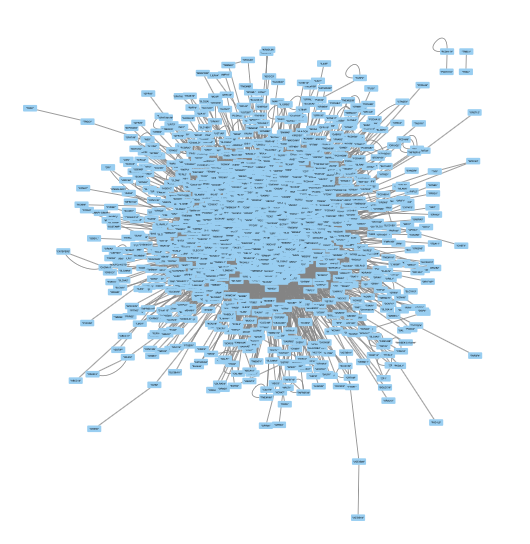
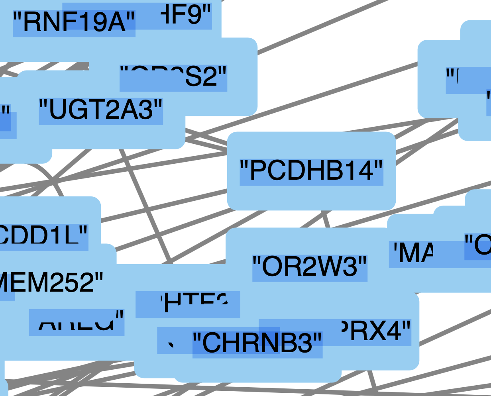
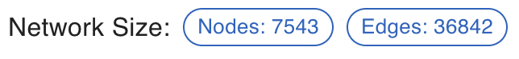
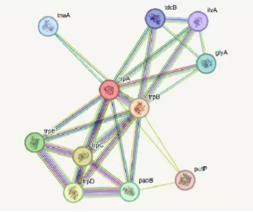

### Product Vision

To create an interactive, user-friendly web platform for visualizing and exploring protein-protein interaction (PPI) networks. The site will allow users to view a global network map, search for specific proteins, and analyze localized subgraphs with detailed node and edge information.

### Product Goals

1.  **Interactive Visualization:** Provide a dynamic and responsive visualization of the entire PPI network that users can intuitively explore.
2.  **Targeted Search:** Enable users to quickly find specific proteins or protein groups and view their immediate interaction neighborhoods.
3.  **Data Accessibility:** Clearly present both graphical and tabular data, including protein details, interaction scores, and tissue enrichment.
4.  **Informative Interface:** Offer at-a-glance statistics and clear legends to help users interpret the network data effectively.

---

### Website Development Roadmap

#### **Page 1: Global Network View**

This page serves as the main entry point and provides a comprehensive overview of the entire PPI network.

**Key Features:**

1.  **Interactive Network Plot:**
    - **Visualization:** Display the full PPI network from your `edge_info_with_exp.csv` and `node_info_with_exp.csv` data.
    - **Navigation:** Implement zoom (in/out) and pan functionalities.
    - **Dynamic Labels:** Node labels (protein names) should appear upon zooming in to avoid clutter.

- Global mode: 
- Zoomed in mode: 

2.  **Sidebar Statistics:** 

    - **Network Size:**
      - **Nodes:** Total count of unique proteins from `node_info_with_exp.csv`.
      - **Edges:** Total count of interactions from `edge_info_with_exp.csv`.
    - **Family Annotations:**
      - Display the total counts for each protein family (e.g., TM, TF).
      - Show counts of edges color-coded by enrichment status (e.g., "Red means enriched").

3.  **Search Box:**
    - **Placement:** Positioned at the bottom of the page for easy access.
    - **Functionality:**
      - **Single Node Search:** Accepts a single protein identifier (e.g., `#1`).
      - **Multi-Node Search:** Accepts multiple comma-separated identifiers (e.g., `#1,#2,#3`).
    - **Action:** Submitting a search query will navigate the user to the second page (Subgraph View).

**Implementation Plan:**

- **Backend:**
  - Develop a script to parse `node_info_with_exp.csv` and `edge_info_with_exp.csv`.
  - Create API endpoints to:
    - Serve the full network data (nodes and edges) for visualization.
    - Provide network statistics for the sidebar.
- **Frontend:**
  - Use a JavaScript library like **D3.js**, **Cytoscape.js**, or **Sigma.js** to render the interactive network graph.
  - Fetch network data and statistics from the backend and display them.
  - Implement the search input form.

---

#### **Page 2: Subgraph View (Search Results)**

This page is triggered by a search and displays a localized view of the network focused on the user's query.

**Key Features:**

1.  **Subgraph Visualization:**
    - **Content:** Display only the queried node(s) and their immediate neighbors (one-step connections).
    - **Node Styling:**
      - **Color:** Assign different colors to nodes based on their `Family` annotation from `node_info_with_exp.csv`.
    - **Edge Styling:**
      - **Length:** Set the edge length based on the `Fusion_Pred_Prob` score. Use a fixed, short length (e.g., representing a score of 1) for experimentally validated positives.
    - **Legend:** Include a clear legend explaining the color-coding for protein families.

- Example: 

2.  **Data Tables:**
    - **Node Information:**
      - Display a table with details for the nodes in the subgraph (showing the top 10 results).
      - Columns: `protein`, `Entry.Name`, `Description`, `Gene.Names`, `Family`, `Expression.tissue`.
    - **Edge Information:**
      - Display a table with details for the edges in the subgraph (showing the top 10 results).
      - Columns: `Edge`, `Protein1`, `Protein2`, `Fusion_Pred_Prob`, `Enriched_tissue`, `Positive_type`.

**Implementation Plan:**

- **Backend:**
  - Create a search API endpoint that:
    - Accepts one or more protein IDs as input.
    - Filters the dataset to find the queried nodes and their first-degree neighbors.
    - Returns the corresponding subgraph data (nodes and edges) and the filtered tabular information.
- **Frontend:**
  - On page load, retrieve the search query from the URL parameters.
  - Call the search API to get the subgraph data.
  - Render the subgraph using the same visualization library as Page 1.
  - Populate the HTML tables with the node and edge information returned from the backend.

### Tech Stacks

This project will use a modern, integrated tech stack chosen for its rapid development capabilities, scalability, and excellent community and AI support.

- **Framework (Frontend & API):** **Next.js**

  - **Why:** Next.js is a React framework that handles both the frontend user interface and the backend API routes in a single project. This simplifies development and deployment. Its file-based routing and server-side rendering capabilities are perfect for creating a fast, responsive user experience.

- **Database & Backend-as-a-Service:** **Supabase**

  - **Why:** Supabase provides a powerful PostgreSQL database along with a suite of backend services out-of-the-box, including auto-generated APIs, authentication, and file storage. This significantly reduces the time spent on backend setup. You can simply upload your `node_info` and `edge_info` CSVs into a Supabase table and immediately start querying the data from your Next.js application.

- **Styling:** **Tailwind CSS**

  - **Why:** A utility-first CSS framework that allows for rapid UI development directly within your HTML/JSX. It pairs perfectly with component-based frameworks like Next.js and helps maintain a consistent design system without writing custom CSS files.

- **Graph Visualization:** **Cytoscape.js**

  - **Why:** A powerful, open-source JavaScript library specifically designed for network analysis and visualization. It is highly performant, customizable, and well-suited for handling the complexities of biological networks like PPIs. It integrates smoothly with React/Next.js.

- **Hosting:** **Vercel**
  - **Why:** Vercel is the platform built by the creators of Next.js, offering a seamless, zero-configuration deployment experience. It provides automatic builds, previews for every Git push, and scales effortlessly from a hobby project to a production-grade application. It also has a generous free tier.

This combination provides a beginner-friendly yet powerful foundation, removing boilerplate and allowing you to focus on building the core features of your PPI network viewer.

---

### Data Format:

I will give you data base in the following format:

#### `edge_info_with_exp.csv`

- `Edge`: concatenation of interacting protein accessions (`Protein1`\_`Protein2`).

- `Protein1`, `Protein2`: UniProt accessions for the interacting proteins.

- `Fusion_Pred_Prob`: model probability that the edge reflects a fusion-derived interaction.

- `Enriched_tissue`: tissue where interaction is enriched; `NA` if not available.

- `Tissue_enriched_confidence`: confidence score for the tissue enrichment; `NA` if not available.

- `Positive_type`: source label for the interaction (for example `prediction`).

#### `node_info_with_exp.csv`

- `protein`: UniProt accession of the protein node.

- `Entry.Name`: UniProt entry name.

- `Description`: short functional description.

- `Gene.Names`: associated gene symbols or aliases.

- `Family`: protein family annotation (`TM` for transmembrane, etc.).

- `Expression.tissue`: tissues with reported expression (backslash-delimited list).
